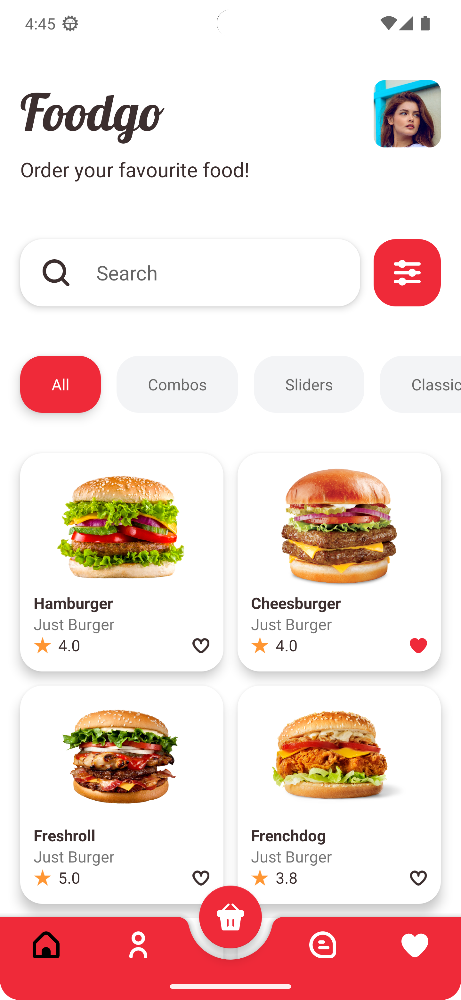
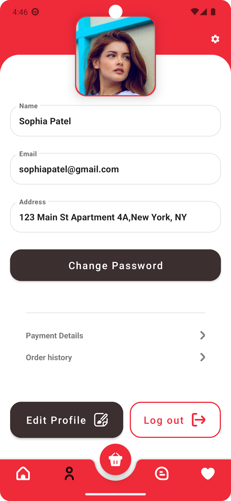
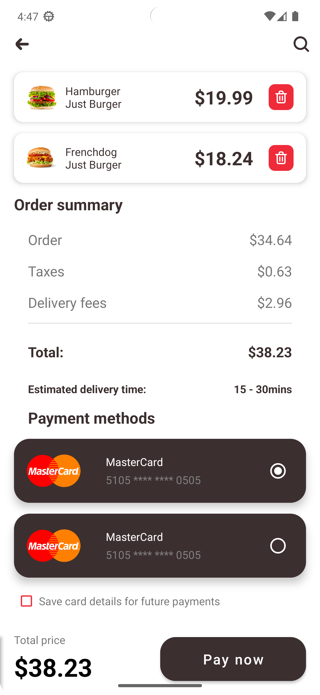
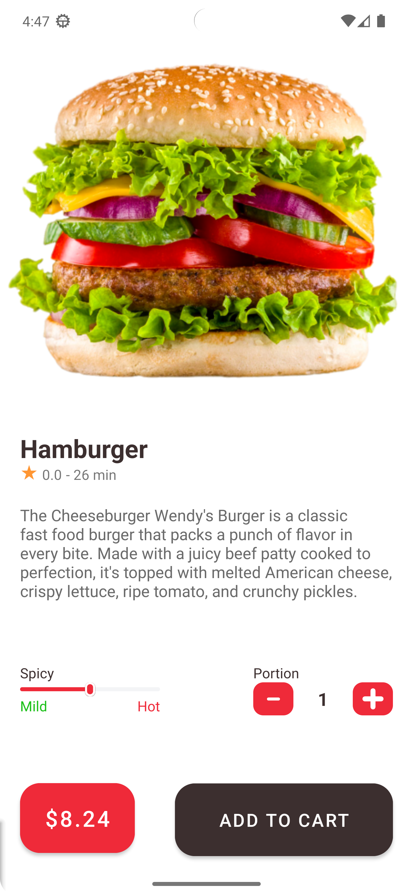

# Burger App

A burger  delivery  app  project.  Practice  working  with  XML  UI  development of android  applications,  Shared  Transition  Animations,  Room  DataBase  and  other  tools.

# Screenshots

# Files
You can try the mobile application by downloading:
[app-debug.apk](app%2Fbuild%2Foutputs%2Fapk%2Fdebug%2Fapp-debug.apk)

